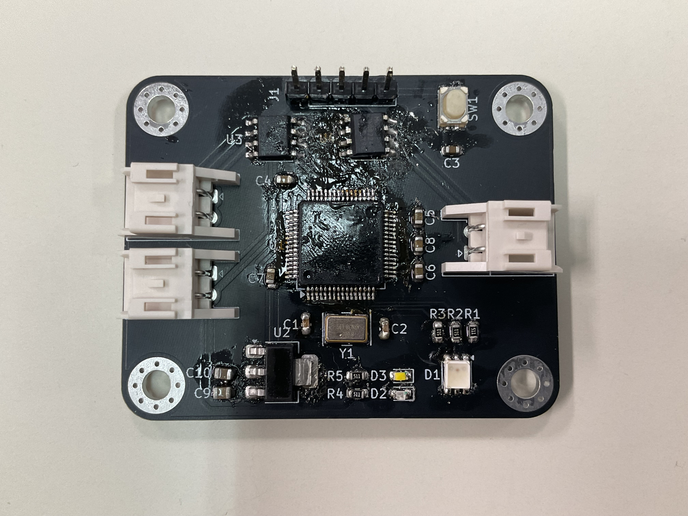
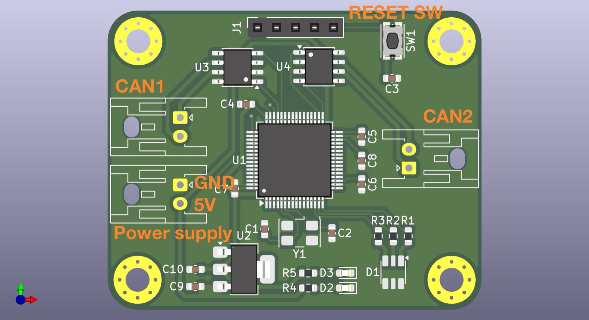
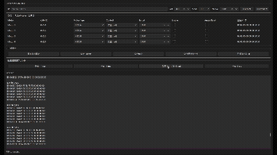
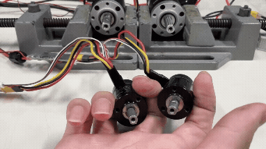

# RoboMaster Controller

STM32を用いて設計・開発した、RoboMaster M2006 / M3508用モータコントローラです。

本リポジトリでは、回路設計・基板設計・ファームウェアを公開しています。
ロボット開発や組込みシステムで再利用できることを目的として製作しました。

---

## 概要

本コントローラは、DJI RoboMasterシリーズのM2006・M3508モータをCAN通信で制御するためのモータコントローラです。

速度制御・位置制御の両方に対応しており、連続角度推定やソフトウェアによる原点リセットなど、ロボット開発で扱いやすい機能を実装しています。

---

## 主な機能

- M2006 / M3508 モータ対応
- CAN通信による制御
- 速度制御（PID）
- 位置制御（カスケードPID）
- エンコーダ多回転角度推定
- ソフトウェア原点リセット
- 通信タイムアウト保護（500 ms）
- デバッグ情報送信（速度・位置誤差）
- RGB LEDによる状態表示

---

## 設計方針・意図

本コントローラは、M2006・M3508を今後のロボット開発で繰り返し利用できることを目的として設計しています。  
機能追加を前提とするのではなく、速度制御・位置制御・多回転角度推定・通信タイムアウト保護など、実際のロボット運用に必要な機能を一つの基板にまとめています。  
私自身がM2006・M3508モータを複数所有しており、今後のロボット開発でも継続して使用する予定です。そのため、毎回制御プログラムを作り直すことなく、共通で利用できるモータコントローラとして設計しました。

---

## ハードウェア

### マイコン

- STM32F446RE

### 通信

- CAN1
    - 上位PC・マイコンとの通信
- CAN2
    - RoboMaster ESCとの通信

### 制御周期

- 制御周期：1 ms（タイマ割り込み）
- CAN受信：受信割り込み

---

## 通信仕様

### 制御コマンド
|ID|num|
|---|---|
|0x221|motor1|
|0x222|motor2|
|0x223|motor3|
|0x224|motor4|

|Byte|内容|
|---|---|
|0|モータ種類|
|1|制御モード|
|2-3|目標値(int16 /1000)|
|4|Enable|
|5|角度リセット|
|6-7|予約|

### モータ種類

|値|内容|
|---|---|
|1|M2006|
|2|M3508|

### 制御モード

|値|内容|
|---|---|
|1|速度制御|
|2|位置制御|

### デバッグ情報

|ID|0~1|2~3|4~5|6~7|
|---|---|---|---|---|
|0x220|motor1_diff|motor2_diff|motor3_diff|motor4_diff|

---

## 安全機能

500 ms以上制御コマンドを受信しなかった場合、

- モータ停止
- PIDリセット
- 出力0

を実行し、通信断による暴走を防止します。

---

## 写真

|基板|3D|
|---|---|
|||

---

## 動作





※gif画像のためにいろいろしたら，LEDの色おかしくなった( ˊᵕˋ ;)

---

## フォルダ構成

```
Firmware/
    inc
    src
    README

PCB/
    pcb
    sch
    step
    production (JLCPCB発注用)
    README
```

---
